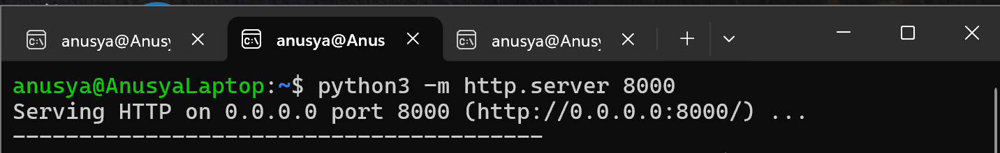
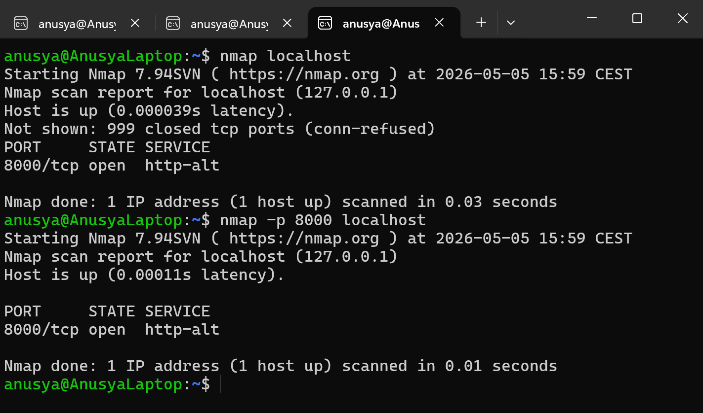

# Lab 01: Discover a Local Web Service with Nmap

## Overview

In this lab, I used Nmap to scan my local machine and detect a simple HTTP service running on `localhost`.

The purpose of this lab was to understand how Nmap identifies open ports and how a local service appears in scan results.

This is a beginner-friendly Nmap lab focused on basic port scanning and service discovery.

## Objective

The goal of this lab was to:

- Start a simple local HTTP server
- Scan `localhost` with Nmap
- Detect an open TCP port
- Scan a specific port using the `-p` option
- Understand what an open port means

## Tools Used

- Nmap
- Python 3
- Ubuntu / WSL terminal

## Scenario

A simple web service is running locally on port `8000`.

The task is to scan the local machine and confirm that Nmap can detect the open port.

This simulates a basic service discovery task where a cybersecurity analyst or beginner pentester checks which services are running on a system.

## Commands Used

### 1. Start a Local HTTP Server

In the Ubuntu terminal, I started a simple HTTP server using Python 3:

```bash
python3 -m http.server 8000
```

This command starts a simple web server on port `8000`.

After running the command, the terminal should show something similar to:

```text
Serving HTTP on 0.0.0.0 port 8000 (http://0.0.0.0:8000/) ...
```

Keep this terminal open while running the Nmap scan.

---

### 2. Open a Second Ubuntu Terminal

Because the HTTP server must continue running, I opened a second Ubuntu terminal to run Nmap commands.

---

### 3. Scan Localhost with Nmap

In the second Ubuntu terminal, I scanned the local machine:

```bash
nmap localhost
```

This command scans `localhost`, which means the local computer.

`localhost` usually points to the loopback IP address:

```text
127.0.0.1
```

---

### 4. Scan Only Port 8000

To scan only the port used by the Python HTTP server, I used:

```bash
nmap -p 8000 localhost
```

The `-p` option tells Nmap to scan a specific port.

In this case, Nmap checks only port `8000`.

## Expected Result

Nmap should show that port `8000/tcp` is open.

Example result:

```text
PORT     STATE SERVICE
8000/tcp open  http-alt
```

## Explanation of the Result

The result means that a TCP service is running on port `8000`.

In this lab, the service is the Python HTTP server that was started with this command:

```bash
python3 -m http.server 8000
```

Nmap detected that the port was open because the service was listening and accepting connections.

## Key Terms

| Term | Meaning |
|---|---|
| `localhost` | The local machine being used |
| `127.0.0.1` | Loopback IP address that points to the local machine |
| Port | A communication endpoint used by network services |
| Open port | A port where a service is running and accepting connections |
| TCP | Transmission Control Protocol, a common network communication protocol |
| Nmap | A tool used for network scanning and service discovery |
| `-p` | Nmap option used to scan a specific port |

## Screenshots

### Python HTTP Server Running



### Nmap Scan Results



## What I Learned

In this lab, I learned how to start a simple local HTTP server and use Nmap to detect it.

I also learned that an open port means a service is listening on that port. This is important in cybersecurity because open ports can show which services are running on a system.

I practiced using basic Nmap commands and learned how to scan a specific port with the `-p` option.

## Security Note

This lab was performed only on `localhost`.

Nmap scans should only be performed on systems that I own or have permission to test. Unauthorized scanning can be illegal and unethical.

## Conclusion

This lab helped me understand the basic idea of service discovery with Nmap.

By starting a local HTTP server and scanning it, I was able to see how Nmap identifies open ports and reports running services.
