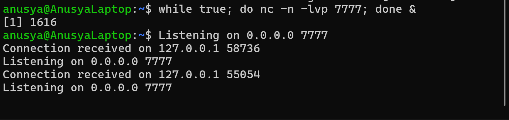
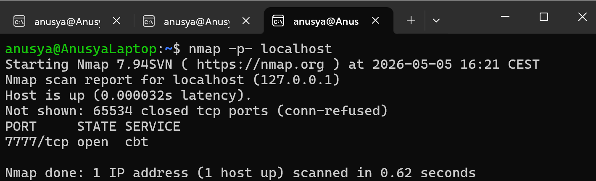
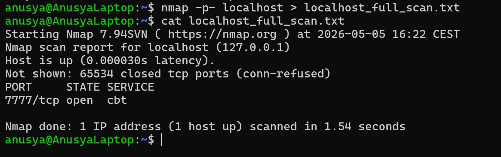

# Lab 02: Find an Open Port on Localhost

## Overview

In this lab, I used Nmap to scan my local machine and find an unknown open port.

I started a simple dummy service on port `7777` using Netcat, then used Nmap to scan all TCP ports on `localhost`. I also saved the scan result to a text file for documentation.

This lab helped me practice full port scanning, identifying open ports, and saving Nmap output.

## Objective

The goal of this lab was to:

- Start a simple local listening service
- Scan `localhost` with Nmap
- Scan all TCP ports using the `-p-` option
- Identify the open port
- Save the scan result to a text file
- Verify the result from the saved file

## Tools Used

- Nmap
- Netcat (`nc`)
- Ubuntu / WSL terminal

## Scenario

A local test service is running on the machine, but the open port is unknown.

The task is to use Nmap to scan all TCP ports on `localhost`, identify the open port, and save the result for documentation.

This simulates a basic discovery task where a cybersecurity analyst checks which ports are open on a system.

## Commands Used

### 1. Check That Nmap Is Installed

```bash
nmap --version
```

This command checks whether Nmap is installed and shows the installed version.

If Nmap is not installed, it can be installed with:

```bash
sudo apt update
sudo apt install nmap
```

---

### 2. Check That Netcat Is Installed

```bash
nc -h
```

This command checks whether Netcat is available.

If Netcat is not installed, it can be installed with:

```bash
sudo apt install netcat-openbsd
```

---

### 3. Start a Dummy Service on Port 7777

```bash
while true; do nc -n -lvp 7777; done &
```

This command starts a simple local listening service on port `7777`.

Explanation:

- `while true` keeps the service running repeatedly
- `nc` starts Netcat
- `-n` disables DNS lookup
- `-l` tells Netcat to listen for connections
- `-v` enables verbose output
- `-p 7777` sets the listening port to `7777`
- `&` runs the command in the background

---

### 4. Scan All TCP Ports on Localhost

```bash
nmap -p- localhost
```

This command scans all TCP ports on the local machine.

The `-p-` option tells Nmap to scan all ports from `1` to `65535`.

---

### 5. Save the Scan Output to a File

```bash
nmap -p- localhost > localhost_full_scan.txt
```

This command runs the full port scan again and saves the output to a file called `localhost_full_scan.txt`.

Saving scan output is useful because it creates a record that can be reviewed later.

---

### 6. View the Saved Scan Result

```bash
cat localhost_full_scan.txt
```

This command displays the saved scan result in the terminal.

## Expected Result

Nmap should show that `localhost` is up and that port `7777/tcp` is open.

Example result:

```text
PORT     STATE SERVICE
7777/tcp open  cbt
```

The exact service name may be different depending on the system. The most important part is that port `7777/tcp` is shown as `open`.

## Explanation of the Result

The result means that a TCP service is listening on port `7777`.

In this lab, the open port was created by the Netcat command:

```bash
while true; do nc -n -lvp 7777; done &
```

Nmap detected the open port because the Netcat service was listening and accepting connections.

## Screenshots

### Netcat Dummy Service Running



### Nmap Full Port Scan Result



### Saved Scan Output File



## Key Terms

| Term | Meaning |
|---|---|
| `localhost` | The local machine being used |
| `127.0.0.1` | Loopback IP address that points to the local machine |
| Port | A communication endpoint used by a network service |
| Open port | A port where a service is running and accepting connections |
| TCP | Transmission Control Protocol, a common network communication protocol |
| Nmap | A tool used for network scanning and service discovery |
| Netcat / `nc` | A command-line tool used to create or connect to network services |
| Dummy service | A simple test service used for practice |
| `-p-` | Nmap option used to scan all ports |
| `>` | A shell operator used to save command output to a file |

## What I Learned

In this lab, I learned how to use Netcat to start a simple listening service on a specific port.

I also learned how to use Nmap to scan all TCP ports on `localhost` with the `-p-` option. This helped me understand that a full port scan checks more ports than a default Nmap scan.

I practiced saving scan results to a text file and verifying the result with the `cat` command.

## Security Note

This lab was performed only on `localhost`.

Nmap scans should only be performed on systems that I own or have permission to test. Unauthorized scanning can be illegal and unethical.

## Conclusion

This lab helped me understand how to find an open port when the port number is unknown.

By starting a dummy service with Netcat and scanning all ports with Nmap, I was able to identify port `7777/tcp` as open and save the result for documentation.
