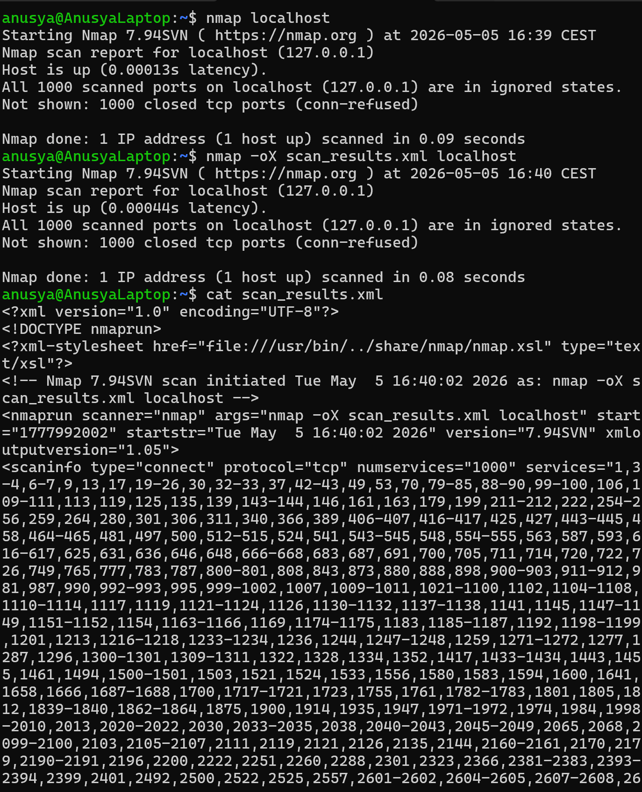

# Lab 03: Save Nmap Output to XML

## Overview

In this lab, I used Nmap to scan `localhost` and save the scan result in XML format.

The purpose of this lab was to practice saving Nmap output to a structured file that can be reused later for reporting, documentation, or automated analysis.

This is a beginner-friendly Nmap lab focused on output formats and scan documentation.

## Objective

The goal of this lab was to:

- Scan `localhost` with Nmap
- Save Nmap output in XML format
- Understand why XML output is useful
- View the saved XML file in the terminal
- Practice documenting scan results

## Tools Used

- Nmap
- Ubuntu / WSL terminal
- `cat` command

## Scenario

A cybersecurity analyst may need to save scan results instead of only viewing them in the terminal.

In this lab, I scanned my local machine and saved the result as an XML file. XML output is useful because it has a structured format and can be read by other tools or scripts.

## Commands Used

### 1. Check That Nmap Is Installed

```bash
nmap --version
```

This command checks whether Nmap is installed and shows the installed version.

If Nmap is not installed, it can be installed with:

```bash
sudo apt update
sudo apt install nmap
```

---

### 2. Run a Basic Nmap Scan

```bash
nmap localhost
```

This command scans the local machine and displays the result directly in the terminal.

`localhost` usually points to the loopback IP address:

```text
127.0.0.1
```

---

### 3. Save Nmap Output to an XML File

```bash
nmap -oX scan_results.xml localhost
```

The `-oX` option tells Nmap to save the scan result in XML format.

In this command:

- `-oX` means output in XML format
- `scan_results.xml` is the name of the output file
- `localhost` is the scan target

---

### 4. View the Saved XML File

```bash
cat scan_results.xml
```

This command displays the content of the XML file in the terminal.

The output may look complex because XML uses tags to organize data.

## Expected Result

After running the scan, a file named `scan_results.xml` should be created in the current directory.

Example:

```bash
ls
```

Expected file:

```text
scan_results.xml
```

The XML file should contain structured Nmap scan information, such as:

```xml
<nmaprun>
  <host>
    <status state="up"/>
    <ports>
      <port protocol="tcp" portid="80">
        <state state="open"/>
      </port>
    </ports>
  </host>
</nmaprun>
```

The exact content may be different depending on which ports are open on the system.

## Explanation of the Result

The scan result is saved in XML format instead of only being printed in the terminal.

XML stands for **Extensible Markup Language**. It is a structured data format that uses tags.

Saving Nmap results in XML is useful because:

- the results can be imported into other security tools
- the results can be processed by scripts
- the scan can be saved for later analysis
- the output is easier to use in reports or automation

## Screenshots

### Nmap XML Output



## Key Terms

| Term | Meaning |
|---|---|
| Nmap | A tool used for network scanning and service discovery |
| XML | Extensible Markup Language, a structured format for storing data |
| `-oX` | Nmap option used to save output in XML format |
| `localhost` | The local machine being used |
| `127.0.0.1` | Loopback IP address that points to the local machine |
| Output file | A file where command results are saved |
| `cat` | Linux command used to display file content |
| Structured data | Data organized in a format that tools can read easily |

## What I Learned

In this lab, I learned how to save Nmap scan results to an XML file using the `-oX` option.

I also learned that XML output is useful because it can be used by other tools, scripts, and reports. This is important in cybersecurity because scan results often need to be saved, shared, or analyzed later.

This lab helped me understand that Nmap is not only useful for scanning, but also for creating structured documentation of scan results.

## Security Note

This lab was performed only on `localhost`.

Nmap scans should only be performed on systems that I own or have permission to test. Unauthorized scanning can be illegal and unethical.

## Conclusion

This lab helped me practice saving Nmap scan results in XML format.

By using the `-oX` option, I created a structured output file that can be used for documentation, reporting, or further analysis.
