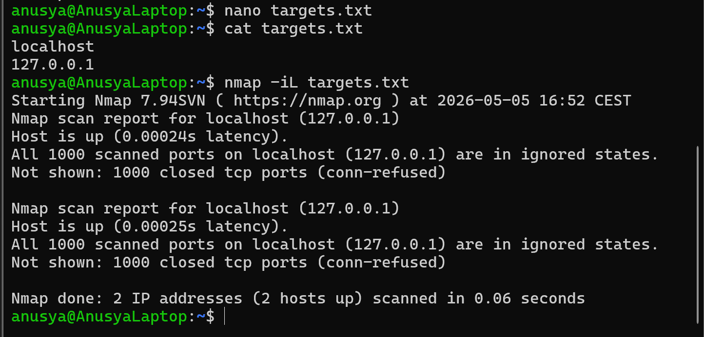

# Lab 04: Scan Targets from a File with Nmap

## Overview

In this lab, I used Nmap to scan multiple targets from a text file.

The purpose of this lab was to practice using a target list instead of typing each target manually in the command line.

This is useful when a cybersecurity analyst needs to scan several hosts in an organized and repeatable way.

## Objective

The goal of this lab was to:

- Create a text file with scan targets
- Use Nmap to read targets from a file
- Scan multiple targets with one command
- Understand the purpose of the `-iL` option
- Practice organizing scan targets for documentation

## Tools Used

- Nmap
- Ubuntu / WSL terminal
- Nano text editor
- `cat` command

## Scenario

A cybersecurity analyst may need to scan more than one host.

Instead of typing each IP address or hostname manually, the targets can be saved in a text file. Nmap can then read the file and scan all listed targets.

In this lab, I created a file with targets and scanned them using Nmap.

## Commands Used

### 1. Create a Target List File

I created a file called `targets.txt`:

```bash
nano targets.txt
```

Inside the file, I added the targets:

```text
localhost
127.0.0.1
```

Then I saved the file.

In Nano:

```text
Ctrl + O
Enter
Ctrl + X
```

---

### 2. View the Target List

I used the `cat` command to check the content of the file:

```bash
cat targets.txt
```

This command displays the targets saved inside `targets.txt`.

Expected output:

```text
localhost
127.0.0.1
```

---

### 3. Scan Targets from the File

I used Nmap with the `-iL` option:

```bash
nmap -iL targets.txt
```

The `-iL` option tells Nmap to read scan targets from a file.

In this command:

- `nmap` starts the scan
- `-iL` means input from list
- `targets.txt` is the file that contains the scan targets

## Expected Result

Nmap should scan each target listed in the file.

Example result:

```text
Nmap scan report for localhost (127.0.0.1)
Host is up.

Nmap scan report for 127.0.0.1
Host is up.
```

The exact result may be different depending on which services are running on the local machine.

## Explanation of the Result

The file `targets.txt` contains the scan targets.

Instead of scanning one target manually, Nmap reads the targets from the file and scans them one by one.

This method is useful when working with multiple IP addresses, hostnames, or systems during network scanning.

## Screenshots

### Nmap Scan Targets from File



## Key Terms

| Term | Meaning |
|---|---|
| Target | A system, IP address, or hostname that is scanned |
| Target list | A file that contains multiple scan targets |
| Nmap | A tool used for network scanning and service discovery |
| `-iL` | Nmap option used to read scan targets from a file |
| `targets.txt` | Text file containing the scan targets |
| `localhost` | The local machine being used |
| `127.0.0.1` | Loopback IP address that points to the local machine |
| `cat` | Linux command used to display file content |
| Nano | A simple terminal-based text editor |

## What I Learned

In this lab, I learned how to scan multiple targets with Nmap by using a target list file.

I also learned that the `-iL` option is useful when scanning more than one host. It makes scanning more organized because targets can be saved, reused, and documented.

This lab helped me understand how cybersecurity analysts can manage scan targets in a cleaner and more repeatable way.

## Security Note

This lab was performed only on local targets.

Nmap scans should only be performed on systems that I own or have permission to test. Unauthorized scanning can be illegal and unethical.

## Conclusion

This lab helped me practice scanning targets from a file with Nmap.

By using the `-iL` option, I was able to scan multiple targets from `targets.txt` instead of typing each target manually.
