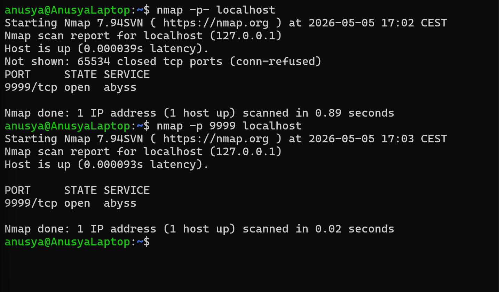

# Lab 05: Uncover the Secret Port with Nmap

## Overview

In this lab, I used Nmap to find a hidden or unknown open port on `localhost`.

The purpose of this lab was to practice scanning all TCP ports instead of only scanning the default Nmap port range.

This is useful because some services may run on uncommon or high-numbered ports. A basic scan may miss them, but a full port scan can help identify them.

## Objective

The goal of this lab was to:

- Start a local service on a non-standard port
- Scan `localhost` with Nmap
- Use a full TCP port scan
- Identify the secret open port
- Understand why full port scanning can be useful

## Tools Used

- Nmap
- Netcat (`nc`)
- Ubuntu / WSL terminal

## Scenario

A service is running on a secret port, but the port number is not obvious from a normal scan.

The task is to use Nmap to scan all TCP ports and discover which port is open.

This simulates a basic reconnaissance task where a cybersecurity analyst or beginner pentester searches for services running on non-standard ports.

## Commands Used

### 1. Start a Secret Local Service

I started a simple listening service using Netcat:

```bash
while true; do nc -n -lvp 9999; done &
```

This command starts a local service on port `9999`.

Explanation:

- `while true` keeps the command running repeatedly
- `nc` starts Netcat
- `-n` disables DNS lookup
- `-l` makes Netcat listen for connections
- `-v` enables verbose output
- `-p 9999` sets the listening port to `9999`
- `&` runs the command in the background

---

### 2. Run a Basic Nmap Scan

```bash
nmap localhost
```

This command runs a default Nmap scan against the local machine.

A default scan checks the most common ports, but it may not always show services running on unusual ports.

---

### 3. Scan All TCP Ports

```bash
nmap -p- localhost
```

The `-p-` option tells Nmap to scan all TCP ports from `1` to `65535`.

This is useful when the open port is unknown or when a service is running on a non-standard port.

---

### 4. Scan the Secret Port Directly

After finding the open port, I scanned it directly:

```bash
nmap -p 9999 localhost
```

This command checks only port `9999`.

## Expected Result

Nmap should show that port `9999/tcp` is open.

Example result:

```text
PORT     STATE SERVICE
9999/tcp open  abyss
```

The exact service name may be different depending on the system. The most important result is that port `9999/tcp` appears as `open`.

## Explanation of the Result

The result means that a TCP service is listening on port `9999`.

In this lab, the open port was created by the Netcat command:

```bash
while true; do nc -n -lvp 9999; done &
```

Nmap detected the port because the Netcat service was active and accepting connections.

A full port scan was useful because the service was running on a non-standard port.

## Screenshots

### Secret Port Discovery with Nmap



## Key Terms

| Term | Meaning |
|---|---|
| Secret port | An open port that is not immediately obvious |
| Open port | A port where a service is running and accepting connections |
| Non-standard port | A port that is not commonly used for a specific service |
| TCP | Transmission Control Protocol, a common network communication protocol |
| Nmap | A tool used for network scanning and service discovery |
| Netcat / `nc` | A command-line tool used to create or connect to network services |
| `-p-` | Nmap option used to scan all TCP ports |
| `-p` | Nmap option used to scan a specific port |
| `localhost` | The local machine being used |
| `127.0.0.1` | Loopback IP address that points to the local machine |

## What I Learned

In this lab, I learned that a default Nmap scan does not always show every possible open port.

I practiced using the `-p-` option to scan all TCP ports. This helped me understand why full port scanning can be important during reconnaissance.

I also learned how to use Netcat to create a simple listening service and then detect it with Nmap.

## Security Note

This lab was performed only on `localhost`.

Nmap scans should only be performed on systems that I own or have permission to test. Unauthorized scanning can be illegal and unethical.

## Conclusion

This lab helped me understand how to discover an unknown or hidden open port with Nmap.

By starting a local service on port `9999` and scanning all TCP ports, I was able to identify the secret open port and confirm it with a targeted scan.