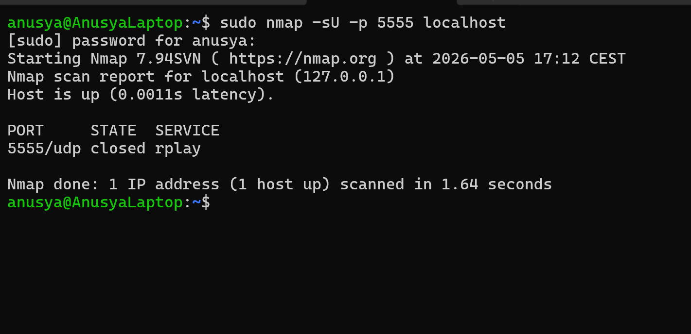

# Lab 06: Find an Open UDP Port with Nmap

## Overview

In this lab, I used Nmap to find an open UDP port on `localhost`.

The purpose of this lab was to practice UDP scanning and understand how it is different from TCP scanning.

This is useful because some important services use UDP, such as DNS, DHCP, NTP, and SNMP. UDP scanning can help identify services that may not appear during a normal TCP scan.

## Objective

The goal of this lab was to:

- Start a simple UDP listener
- Scan `localhost` for UDP ports
- Use the Nmap `-sU` option
- Identify an open UDP port
- Understand the difference between TCP and UDP scanning

## Tools Used

- Nmap
- Netcat (`nc`)
- Ubuntu / WSL terminal

## Scenario

A UDP service is running locally on the machine.

The task is to use Nmap to scan for UDP services and identify the open UDP port.

This simulates a basic network discovery task where a cybersecurity analyst checks for UDP services running on a system.

## Commands Used

### 1. Start a UDP Listener

I started a simple UDP listener using Netcat:

```bash
nc -u -l -p 5555
```

This command starts a UDP listener on port `5555`.

Explanation:

- `nc` starts Netcat
- `-u` tells Netcat to use UDP instead of TCP
- `-l` makes Netcat listen for incoming connections
- `-p 5555` sets the listening port to `5555`

Keep this terminal open while running the Nmap scan.

---

### 2. Open a Second Ubuntu Terminal

Because the UDP listener must continue running, I opened a second Ubuntu terminal to run the Nmap command.

---

### 3. Scan the UDP Port with Nmap

In the second terminal, I scanned UDP port `5555`:

```bash
sudo nmap -sU -p 5555 localhost
```

Explanation:

- `sudo` gives Nmap the permissions needed for UDP scanning
- `-sU` tells Nmap to perform a UDP scan
- `-p 5555` tells Nmap to scan only port `5555`
- `localhost` is the local machine

## Expected Result

Nmap should show that UDP port `5555` is open or open|filtered.

Example result:

```text
PORT     STATE         SERVICE
5555/udp open|filtered rplay
```

The service name may be different depending on the system.

For UDP scans, Nmap may show `open|filtered` instead of only `open`. This happens because UDP does not use a connection handshake like TCP.

## Explanation of the Result

The result means that Nmap found a UDP port that may be open.

In this lab, the UDP listener was created with this command:

```bash
nc -u -l -p 5555
```

UDP scanning is different from TCP scanning because UDP is connectionless. This means there is no three-way handshake like in TCP.

Because of this, UDP scan results can sometimes be less clear. Nmap may report a port as `open|filtered` when it cannot confirm whether the port is definitely open or blocked by a firewall.

## Screenshots

### UDP Port Scan with Nmap



## Key Terms

| Term | Meaning |
|---|---|
| UDP | User Datagram Protocol, a connectionless network protocol |
| TCP | Transmission Control Protocol, a connection-based network protocol |
| UDP port | A communication endpoint used by a UDP service |
| Open port | A port where a service is running and accepting traffic |
| `open|filtered` | Nmap result meaning the port may be open or filtered |
| Nmap | A tool used for network scanning and service discovery |
| Netcat / `nc` | A command-line tool used to create or connect to network services |
| `-sU` | Nmap option used to perform a UDP scan |
| `-p` | Nmap option used to scan a specific port |
| `localhost` | The local machine being used |
| `127.0.0.1` | Loopback IP address that points to the local machine |

## What I Learned

In this lab, I learned how to scan UDP ports with Nmap using the `-sU` option.

I also learned that UDP scanning is different from TCP scanning because UDP does not create a normal connection before sending data. Because of this, UDP scan results can sometimes show `open|filtered`.

This lab helped me understand why UDP scanning is important in cybersecurity and why it may require more careful interpretation than TCP scanning.

## Security Note

This lab was performed only on `localhost`.

Nmap scans should only be performed on systems that I own or have permission to test. Unauthorized scanning can be illegal and unethical.

## Conclusion

This lab helped me practice finding an open UDP port with Nmap.

By starting a UDP listener with Netcat and scanning it with `sudo nmap -sU`, I was able to understand how UDP scanning works and why the results can be different from TCP scans.