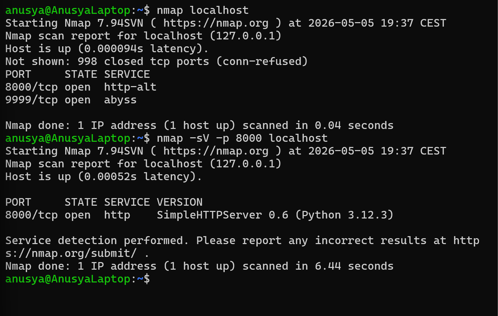

# Lab 07: Identify Linux Server Version with Nmap

## Overview

In this lab, I used Nmap to identify service and version information on `localhost`.

The purpose of this lab was to practice Nmap version detection and understand how Nmap can collect more detailed information about running services.

This is useful in cybersecurity because service versions can help analysts identify outdated software, possible vulnerabilities, and misconfigurations.

## Objective

The goal of this lab was to:

- Scan `localhost` with Nmap
- Use service version detection
- Identify running services
- Understand the purpose of the `-sV` option
- Learn why service version information is important in security analysis

## Tools Used

- Nmap
- Python 3
- Ubuntu / WSL terminal

## Scenario

A service is running on the local machine.

The task is to scan the system with Nmap and collect service version information. This simulates a basic reconnaissance task where a cybersecurity analyst or beginner pentester checks what services are running and what versions they may be using.

## Commands Used

### 1. Start a Local HTTP Server

I started a simple HTTP server using Python 3:

```bash
python3 -m http.server 8000
```

This command starts a local web service on port `8000`.

Keep this terminal open while running the Nmap scan.

---

### 2. Open a Second Ubuntu Terminal

Because the HTTP server must continue running, I opened a second Ubuntu terminal to run Nmap commands.

---

### 3. Run a Basic Nmap Scan

In the second terminal, I scanned `localhost`:

```bash
nmap localhost
```

This command shows open ports on the local machine.

---

### 4. Run Service Version Detection

To identify service and version information, I used:

```bash
nmap -sV localhost
```

The `-sV` option tells Nmap to try to detect the version of services running on open ports.

---

### 5. Run Version Detection on a Specific Port

Because the Python HTTP server is running on port `8000`, I also scanned only that port:

```bash
nmap -sV -p 8000 localhost
```

Explanation:

- `-sV` enables service version detection
- `-p 8000` tells Nmap to scan only port `8000`
- `localhost` is the target machine

## Expected Result

Nmap should show that port `8000/tcp` is open and running an HTTP service.

Example result:

```text
PORT     STATE SERVICE VERSION
8000/tcp open  http    SimpleHTTPServer
```

The exact service name or version may be different depending on the Python version and system configuration.

## Explanation of the Result

The result means that Nmap detected a service running on port `8000`.

In this lab, the service was created by the Python HTTP server:

```bash
python3 -m http.server 8000
```

Using `-sV`, Nmap tried to identify more information about the service, not just whether the port was open.

This is important because knowing the service and version can help security analysts check whether the software is outdated or vulnerable.

## Screenshots

### Nmap Service Version Detection



## Key Terms

| Term | Meaning |
|---|---|
| Nmap | A tool used for network scanning and service discovery |
| Service | A program running on a system and listening on a port |
| Version detection | The process of identifying service software and version information |
| `-sV` | Nmap option used to detect service versions |
| `-p` | Nmap option used to scan a specific port |
| Port | A communication endpoint used by a network service |
| Open port | A port where a service is running and accepting connections |
| HTTP | Hypertext Transfer Protocol, used for web communication |
| `localhost` | The local machine being used |
| `127.0.0.1` | Loopback IP address that points to the local machine |
| Reconnaissance | The process of collecting information about a system or network |

## What I Learned

In this lab, I learned how to use Nmap service version detection with the `-sV` option.

I also learned that an open port only shows that a service is running, but version detection can provide more details about what service may be running.

This is important in cybersecurity because service version information can help identify outdated software and possible vulnerabilities.

## Security Note

This lab was performed only on `localhost`.

Nmap scans should only be performed on systems that I own or have permission to test. Unauthorized scanning can be illegal and unethical.

## Conclusion

This lab helped me understand how Nmap can be used to identify service and version information.

By starting a local HTTP server and scanning it with `nmap -sV`, I practiced collecting more detailed information about a running service.